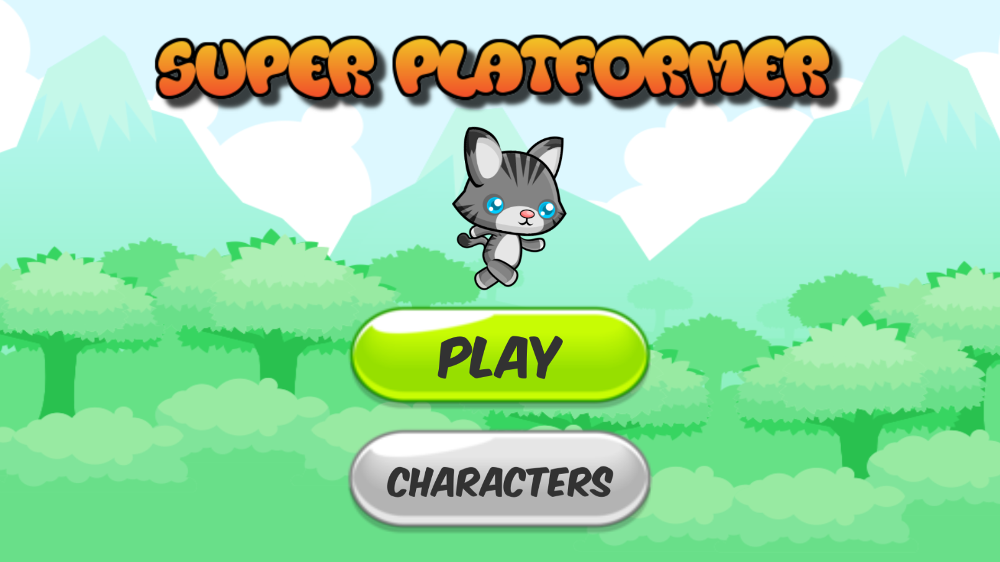
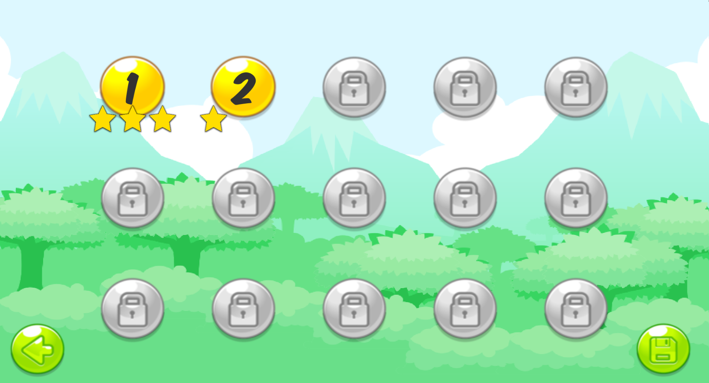
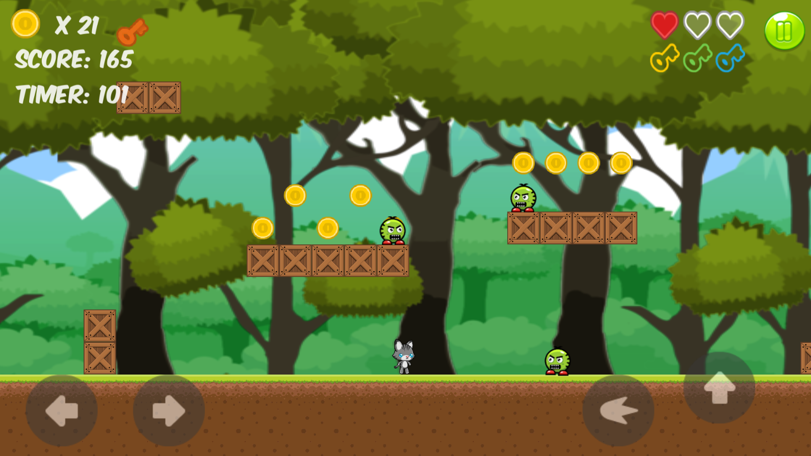
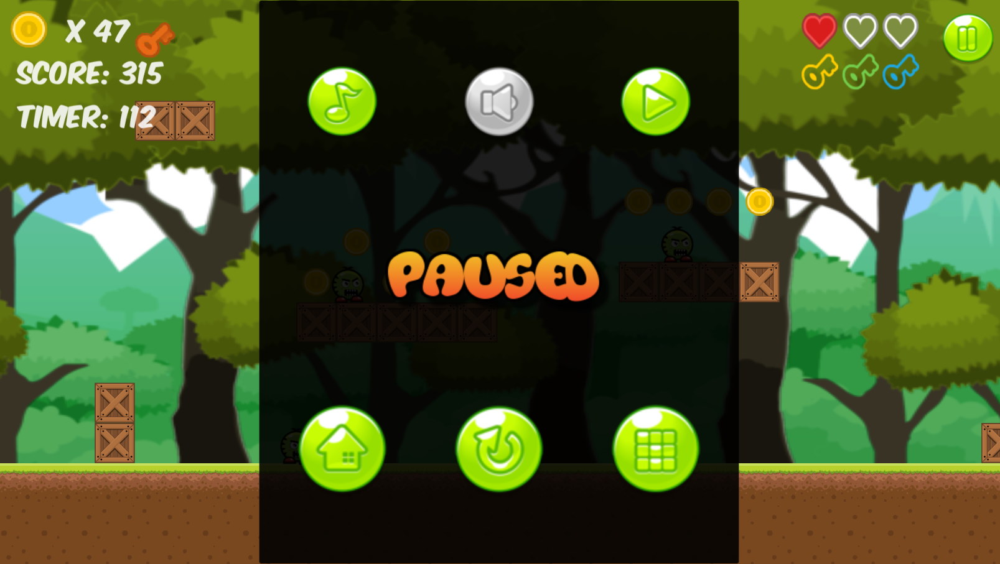
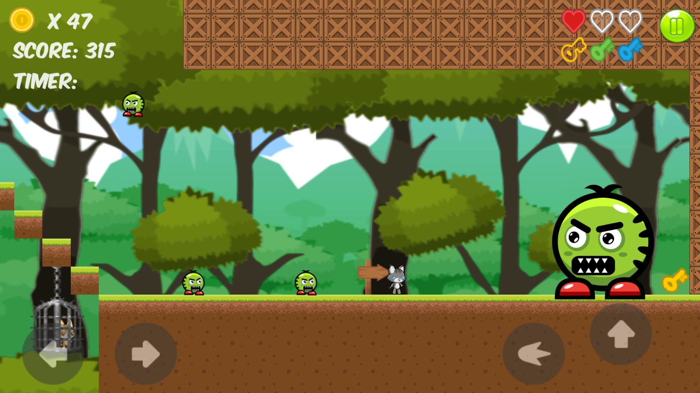
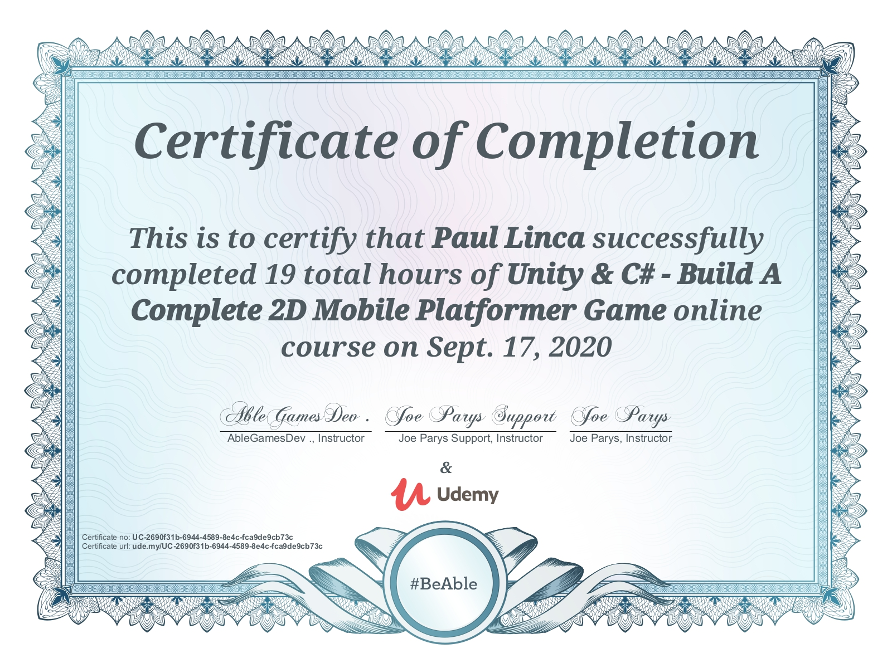

# Android Platformer Game Build with Unity
This is the tutorial I followed in order to learn how to develop games using Unity.  
Link: https://www.udemy.com/course/unity-2d-course-build-a-mobile-platformer-game-from-scratch/

**What I learned**
* How to create a game from scratch
* Created and worked with Prefabs
* Worked with Colliders and Collision Detection
* Useed the components of Unity 2d Physics
* Created an animated 2D game character with behaviors like left/right movement, jump, fire bullets, pickup coins, crush enemies, water splash and more
* Programmed enemy characters with basic AI
* Many game mechanics like Parallax effect, Garbage collection, showing particles and SFX
* Understood best practices of Level Design
* Learned the best practices of working within Unity editor and C# scripting
* How to monetize a game using ads
* How to deploy a game/app to the Google Play store

### Screenshots
 

### Udemy Certificate

